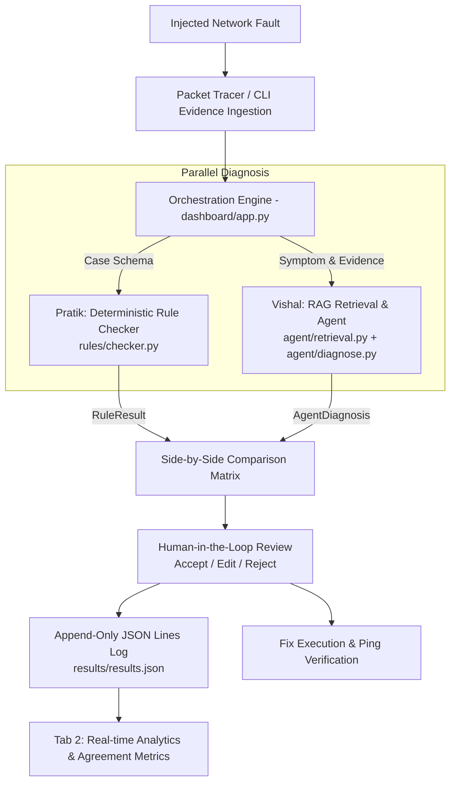

# NetSage AI — Dashboard, Orchestration & Integration Contract
**Author:** Manmath (Dashboard & Orchestration Lead)  
**Project:** Cisco Network Support Squad — Cisco Virtual Internship Program (VIP) 2026

---

## 1. System Architecture & Orchestration Flow

NetSage AI bridges deterministic network verification with generative multi-case RAG diagnostics in a closed human-in-the-loop remediation lifecycle.

### Mentor's Workflow
$$\text{Fault Injected} \longrightarrow \text{Raw Telemetry / Evidence} \longrightarrow \text{Deterministic Rules + RAG Agent} \longrightarrow \text{Side-by-Side Comparison} \longrightarrow \text{Human Review} \longrightarrow \text{Fix Application} \longrightarrow \text{Verification}$$



---

## 2. Dashboard Interface & Tab Layout

### Tab 1: "🔍 Diagnose a Case"
```
+---------------------------------------------------------------------------------------+
|  NetSage AI — Network Diagnostic Studio                                               |
+---------------------------------------------------------------------------------------+
|  [⚡ Quick Load Sample Case: case_01 (vlan_mismatch)          v]  [ 🧹 Clear Form ]   |
|                                                                                       |
|  Reported Symptom:                                                                    |
|  [ PC0 cannot reach router gateway or PC1 even though PC0 has valid IP...          ]  |
|                                                                                       |
|  Raw Telemetry & Command Evidence (Pasted live by Krishna):                           |
|  [ Switch#show vlan brief                                                          ]  |
|  [ 10 USERS active                                                                 ]  |
|  [ 20 SERVERS active Fa0/1, Fa0/2 ...                                              ]  |
|                                                                                       |
|  [ > Optional Metadata (Topology: topo_A | Fault: vlan_mismatch) ]                    |
|                                                                                       |
|  [ 🚀 Diagnose Case ]                                                                 |
+---------------------------------------------------------------------------------------+
|  DIAGNOSIS RESULTS (Side-by-Side Comparison)                                          |
|                                                                                       |
|  🛡️ Deterministic Rule Engine (Pratik)      🧠 Diagnostic Agent & RAG (Vishal)         |
|  -------------------------------------      ---------------------------------------   |
|  Verdict: Flagged: port stuck on wrong      Root Cause: VLAN misconfiguration — port  |
|           default VLAN.                                 Fa0/1 assigned to VLAN 20.    |
|                                             Confidence: [ 92% ] | Layer: Layer 2      |
|  [x] Duplicate IP            PASSED         Evidence: Fa0/1 in VLAN 20 (SERVERS)      |
|  [x] Subnet Mask Mismatch    PASSED         Next Cmd: `show vlan brief`               |
|  [x] Gateway Mismatch        PASSED         Fix Plan:                                 |
|  [x] Interface Down          PASSED           1. interface Fa0/1                      |
|  [!] Missing / Wrong VLAN    FLAGGED          2. switchport access vlan 10            |
|  [x] Missing Route           PASSED           3. do ping 192.168.1.1                  |
|  [x] Bad / Restrictive ACL   PASSED         Retrieved Past Cases: [case_01, case_05]  |
+---------------------------------------------------------------------------------------+
|  HUMAN-IN-THE-LOOP REVIEW & LOGGING                                                   |
|  Decision: (o) Accept Diagnosis   ( ) Edit Plan   ( ) Reject Diagnosis                |
|  Reviewer Note: [ Verified in Packet Tracer topology A, ping succeeded after VLAN fix. ]|
|  [ 💾 Submit Review & Log Case ]                                                      |
+---------------------------------------------------------------------------------------+
```

### Tab 2: "📊 Dashboard & Analytics"
```
+---------------------------------------------------------------------------------------+
|  KEY METRICS                                                                          |
|  [ Total Diagnoses: 18 ]  [ Acceptance: 94.4% ]  [ Agreement: 88.9% ]  [ Conf: 91% ]  |
+---------------------------------------------------------------------------------------+
|  CHARTS                                                                               |
|  Case Count per Fault Type                  Human Review Verdicts Distribution        |
|  | #                                        | ################## (Accepted: 17)       |
|  | ####                                     | # (Edited: 1)                           |
|  | ########                                 | (Rejected: 0)                           |
|  +------------------------>                 +------------------------>                |
|    vlan  mask  route  acl                     Accepted    Edited    Rejected          |
+---------------------------------------------------------------------------------------+
|  RULE ENGINE VS. AGENT AGREEMENT MATRIX                                               |
|  +---------+---------------+--------------------------+--------------------+---------+|
|  | Case ID | Fault Type    | Rule Verdict             | Agent Root Cause   | Status  ||
|  +---------+---------------+--------------------------+--------------------+---------+|
|  | case_01 | vlan_mismatch | Flagged: wrong VLAN      | VLAN misconfig     | 🤝 Agree||
|  | case_02 | wrong_mask    | Flagged: mismatched mask | Subnet mask error  | 🤝 Agree||
|  | case_03 | missing_route | Flagged: missing route   | Routing entry miss | 🤝 Agree||
|  +---------+---------------+--------------------------+--------------------+---------+|
+---------------------------------------------------------------------------------------+
```

---

## 3. Engineering Decisions & Rationale

### Why Streamlit?
1. **Zero-Latency Live Demoing:** Allows single-page execution with reactive state management (`st.session_state`), instant side-by-side comparative inspection, and interactive human feedback without complex frontend plumbing.
2. **Native Data Science Visualization:** Seamless integration with `pandas`, interactive bar charts, and data tables for Tab 2 analytics directly from log records.
3. **Rapid Containerization:** Lightweight, runs out-of-the-box in Docker with a single `docker-compose up`.

### Why `shared/schema.py` Integration Contract?
1. **Single Source of Truth:** `Case`, `RuleResult`, `AgentDiagnosis`, and `ReviewResult` are defined with strict typing using Pydantic. No teammate invents ad-hoc dictionary keys or field typos.
2. **Parallel Decoupled Development:** Pratik builds `rules/checker.py` and Vishal builds `agent/` independently against the exact same contract.
3. **Append-Safe Persistence:** The unified record maps directly to `results/results.json` in JSON Lines format, ensuring atomic, thread-safe, and corrupt-free logging during live presentations.

---

## 4. Quick Start & Docker Deployment

Run the complete pipeline with one command:
```bash
docker-compose up --build
```
Access the dashboard at `http://localhost:8501`.
